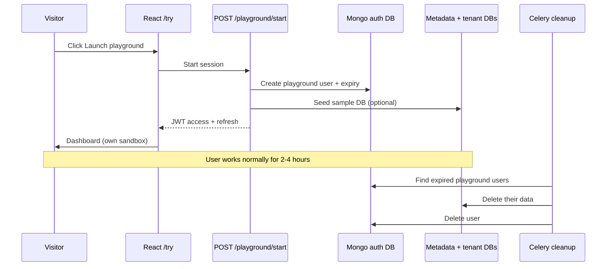
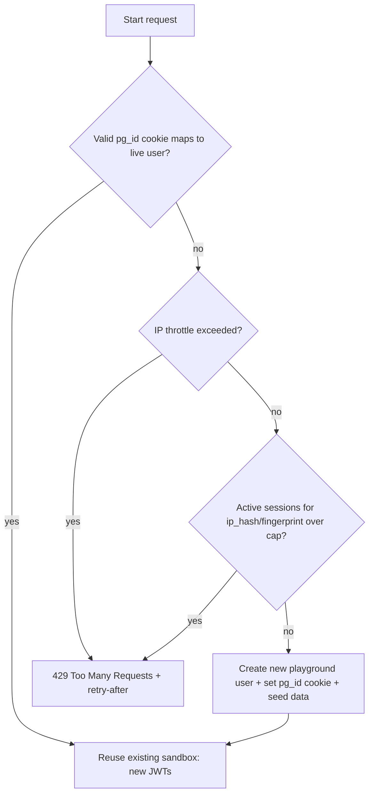

**Ephemeral playground sessions** means: every visitor who clicks “Try Datacube” gets their **own temporary account and sandbox**, instead of everyone sharing one demo login.

## Today (what you have now)

```293:317:backend/core/presentation/views/auth_views.py
class DemoLoginView(APIView):
    ...
    def post(self, request):
        demo_email = getattr(settings, "DEMO_LOGIN_EMAIL", "samanta@dowellresearch.se")
        ...
        refresh = RefreshToken.for_user(proxy_user)
        return Response({"access": ..., "refresh": ..., "role": ...})
```

- One fixed email (`DEMO_LOGIN_EMAIL`)
- Everyone logs into **the same user**
- All data goes into **the same databases**
- Visitors can overwrite each other’s work
- The old static `/demo/` page was fragile and often broke on deploy

---

## Proposed flow (user experience)

1. User opens **`/try`** in the React app (no separate static HTML page).
2. They click **“Launch playground”**.
3. Frontend calls something like **`POST /core/api/v2/playground/start/`** (or we evolve the existing demo endpoint).
4. Backend:
   - Creates a **new user**, e.g. `playground-<uuid>@demo.datacube.internal`
   - Marks them as playground: `is_playground: true`
   - Sets expiry: `playground_expires_at = now + 2–4 hours`
   - Optionally **seeds sample data** (1 DB, a few collections, sample docs)
   - Returns **JWT access + refresh** (same as normal login)
5. User lands on the dashboard and uses Datacube normally.
6. After TTL (or a nightly job), backend **deletes that user + all their metadata/data/files**.

From the visitor’s perspective: *“I got my own fresh sandbox for a few hours.”*

---

## Why this fits Datacube well

Your app is already **user-scoped**. Metadata, CRUD, files, analytics — all keyed by `user_id`:

```12:16:backend/api/application/service_context.py
    def __init__(self, user_id: str, *, role: str | None = None) -> None:
        ...
        self.user_id = str(user_id)
```

So a playground user is just a normal user with extra flags and limits. No new auth system needed — only a different **creation + cleanup** path.

---

## What gets stored on the playground user

Example user document in Mongo auth DB:

```json
{
  "email": "playground-a1b2c3...@demo.datacube.internal",
  "firstName": "Playground",
  "lastName": "Guest",
  "is_email_verified": true,
  "auth_method": "playground",
  "is_playground": true,
  "playground_expires_at": "2026-06-25T20:00:00Z",
  "role": "developer",
  "subscription_plan": "free"
}
```

That user then gets their own metadata DB entries, tenant DBs, and files — isolated from real users and from other playground sessions.

---

## Sample data seeding (optional but recommended)

On session start, backend could auto-create:

| Item | Example |
|------|---------|
| 1 database | `demo_store` |
| 2–3 collections | `products`, `orders` |
| A few documents | Pre-filled rows so the dashboard isn’t empty |
| Maybe 1 sample file | Small GridFS upload demo |

This is a one-time clone from a **template** stored in code or a fixed seed user — not hand-built each time from scratch.

---

## Limits (abuse protection)

Playground users would have **stricter caps** than normal free users, e.g.:

| Limit | Playground | Normal free user |
|-------|------------|------------------|
| Max databases | 1 | higher |
| Max collections | 3 | higher |
| Max documents | ~100 | higher |
| File uploads | off or 1 MB | normal |
| API keys | disabled | allowed |
| Admin actions | disabled | per role |
| Session lifetime | 2–4 hours | permanent |
| Rate limit | stricter on start endpoint | normal |

Enforced by checking `is_playground` in services/middleware before create/upload/key operations.

---

## Cleanup (the “ephemeral” part)

Two mechanisms:

1. **TTL on the user** — `playground_expires_at`; expired JWTs stop working after refresh window.
2. **Celery periodic task** (e.g. every hour or nightly):
   - Find users where `is_playground: true` and `playground_expires_at < now`
   - Delete their metadata, tenant DBs, GridFS files, auth user record

So sandboxes don’t pile up in Mongo forever.

---

## Frontend changes (small)

- Add route: **`/try`**
- Button → `POST /core/api/v2/playground/start/`
- Store tokens with existing `authStore` (same as login)
- Redirect to `/dashboard/overview`
- Optional banner: *“Playground session — expires in 3h. Sign up to keep your data.”*

No separate nginx static mount, no localStorage hacks on a different page.

---

## End-to-end diagram



---

## Compared to alternatives

| Approach | Problem |
|----------|---------|
| Shared demo account | Everyone trashes the same data |
| Static `/demo/` HTML page | Breaks on deploy, awkward token handoff |
| Read-only demo | Can’t really “play” with CRUD |
| **Ephemeral sessions** | Fresh, isolated, auto-cleaned |

---

## Summary in one sentence

**Each “Try Datacube” click creates a short-lived, limited, fully isolated user with optional seed data; they use the real app with normal JWTs; cleanup removes them automatically when time is up.**

If you want to implement on `feat/ephemeral-playground-sessions`, a sensible order is:

1. Backend: `playground/start` + user flags + limits  
2. Celery: cleanup task  
3. Frontend: `/try` route  
4. Optional: seed template  
5. Docs + remove old demo login path


Good question — this is the **abuse-control** side of ephemeral sessions: how do you recognize a returning visitor so one person can’t spin up unlimited sandboxes (and flood Mongo)?

The honest answer up front: **there is no perfectly reliable way to identify a returning anonymous visitor.** Every signal can be defeated (incognito, VPN, new device). So the goal isn’t bulletproof identity — it’s **raising the cost of abuse enough** while keeping the “one click, no signup” experience. You layer several weak signals and reuse/limit rather than block.

Here are the signals, weakest-to-strongest, and how I’d combine them.

## 1. IP address

**What:** `request.META["REMOTE_ADDR"]` / `X-Forwarded-For` (behind nginx, trust the proxy header).

**Use:** Rate-limit session creation per IP, e.g. *max 3 playground starts per IP per hour*. You already have a `demo_login` throttle scope — extend that.

**Caveats:**
- Shared IPs (offices, universities, mobile carriers, NAT) → many real users behind one IP. Don’t hard-block; just throttle.
- VPN / mobile data switching defeats it trivially.

So IP is good for **rate limiting**, bad for **identity**.

## 2. Browser-stored session handle (the practical primary signal)

**What:** When a playground session is created, set a long-lived **`playground_token`** — either:
- an **httpOnly cookie** (e.g. `pg_id=<uuid>`, 30-day expiry), or
- a value in `localStorage` the `/try` page sends back.

On next visit, if that token maps to a **still-valid playground user**, **reuse it** instead of creating a new one.

**Why this is the best UX/abuse tradeoff:**
- A normal returning visitor lands back in *their* sandbox → no new user created.
- Clearing cookies / incognito starts fresh — acceptable, that’s a “new visitor.”
- It naturally prevents the common case (refreshing the page = new account every time).

**Caveat:** It’s opt-out by clearing storage, so pair with IP throttling for the adversarial case.

## 3. Device / browser fingerprint

**What:** A hash of stable-ish attributes (user-agent, language, timezone, screen, canvas/WebGL via a library like FingerprintJS). Store `fingerprint_hash` on the playground user.

**Use:** Soft signal — *“we’ve seen this fingerprint N times in the last hour”* → throttle or reuse.

**Caveats:**
- Fingerprints collide (many identical default browsers) and drift (browser updates).
- Privacy considerations; some users/extensions actively block it.
- Treat as **secondary**, never as a unique key.

## 4. Combined identity key

Store a few fields on each playground user so you can match returns and enforce caps:

```json
{
  "is_playground": true,
  "playground_session_id": "uuid-in-cookie",
  "created_ip": "203.0.113.5",
  "ip_hash": "sha256(ip + salt)",
  "fingerprint_hash": "sha256(fp components)",
  "user_agent": "Mozilla/5.0 ...",
  "playground_expires_at": "2026-06-25T20:00:00Z"
}
```

Recommended **lookup order** on `POST /playground/start`:



## 5. Concrete limits I’d set

| Control | Suggested value | Enforced by |
|--------|-----------------|-------------|
| Reuse window | If `pg_id` cookie → existing live user, reuse | cookie lookup |
| Sessions per IP | 3 / hour, 10 / day | throttle (`ip_hash`) |
| Concurrent live sessions per IP | 2–3 | query `is_playground` + `created_ip` |
| Session TTL | 2–4 hours | `playground_expires_at` |
| Global playground cap | e.g. max 500 live sandboxes | count guard → 503 “demo busy” |

The **global cap** matters: it protects Mongo/storage even if all per-visitor tracking is bypassed by a botnet.

## 6. Privacy notes (important)

- **Hash + salt** IP and fingerprint (`sha256(ip + SECRET)`); don’t store raw IPs longer than needed.
- Mention demo tracking in your privacy/terms blurb on `/try`.
- Cleanup job should delete these identity fields with the user (they’re ephemeral too).

---

### Recommendation

For Datacube’s “one-click, no signup” goal, use a **3-layer** scheme:

1. **Cookie session handle** → primary, drives *reuse* (best UX, kills the refresh-spam case).
2. **Per-IP rate limit + concurrent cap** (hashed) → stops casual scripted abuse.
3. **Global live-sandbox cap** → protects the backend no matter what.

Add **fingerprint** only later if you see real abuse — it’s the highest effort and lowest reliability.

Want me to add an **“Abuse control & visitor identification”** section to `IGNORE_DIR_DOCS/palyground_implementation.md` capturing this (fields, lookup order, limits), so it’s part of the implementation plan before we start coding on `feat/ephemeral-playground-sessions`?