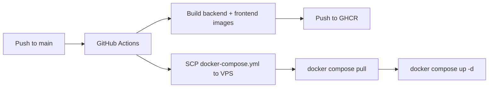

# VPS deployment (GitHub Actions + GHCR)

Images are **built and pushed in GitHub Actions** (backend via `uv sync` in `backend/Dockerfile.prod`). The VPS only receives `docker-compose.yml` and runs `docker pull` + `compose up` — no git clone and no `docker build` on the server.

## Flow



## One-time VPS setup

1. **Install Docker** and Docker Compose v2.

2. **Create deploy directory** (must match GitHub secret `WORKING_DIR`):

   ```bash
   sudo mkdir -p /opt/datacube/config
   sudo chown -R "$USER:$USER" /opt/datacube
   cd /opt/datacube
   ```

3. **Docker network**:

   ```bash
   docker network create app-network
   ```

4. **Environment files** (stay on the server; never committed):

   ```bash
   cp .env.example .env
   cp config/backend.env.example config/backend.env
   # Edit both files with real values
   ```

   Set `BACKEND_IMAGE` / `FRONTEND_IMAGE` to your GHCR paths, e.g.  
   `ghcr.io/<github-username>/datacube-backend`.

5. **GHCR pull access** — create a GitHub PAT with `read:packages` and store it as GitHub secret `GHCR_PULL_TOKEN`. The deploy workflow logs in on the VPS before `docker compose pull`.

   For **private** packages, the PAT user must have access to the repo. Alternatively, make package visibility **public** in GitHub Packages settings.

6. **Reverse proxy** — `docker-compose.yml` does not include the public TLS nginx. Terminate HTTPS on the host (or a separate nginx container) and proxy to `react-app:80` and paths `/api/`, `/core/`, `/analytics/` to `backend:8000`. See `nginx/nginx.prod.conf` for a reference config.

   Recommended body size on `/api/`:

   ```nginx
   client_max_body_size 100m;
   ```

## GitHub configuration

### Repository secrets (Settings → Secrets → Actions)

| Secret | Purpose |
|--------|---------|
| `SSH_HOST` | VPS hostname or IP |
| `SSH_PORT` | SSH port (e.g. `22`) |
| `USER_NAME` | SSH user |
| `SSH_PRIVATE_KEY` | Private key (PEM) |
| `WORKING_DIR` | Deploy path on VPS (e.g. `/opt/datacube`) |
| `GHCR_PULL_TOKEN` | PAT with `read:packages` for `docker pull` on VPS |

### Repository variables (Settings → Variables → Actions)

| Variable | Purpose |
|----------|---------|
| `VITE_API_BASE` | Public API origin baked into the frontend (e.g. `https://datacube.example.com`) |

### Optional secrets (OAuth baked into frontend build)

| Secret | Purpose |
|--------|---------|
| `VITE_GITHUB_OAUTH_CLIENT_ID` | GitHub OAuth client id |
| `VITE_GOOGLE_OAUTH_CLIENT_ID` | Google OAuth client id |
| `VITE_OAUTH_REDIRECT_URI` | OAuth callback URL |

### Environment

Create a **production** environment in GitHub if you use protection rules; the deploy workflow uses `environment: production`.

## Manual deploy on the VPS

```bash
cd /opt/datacube
export IMAGE_TAG=latest   # or a commit SHA tag from GHCR
docker login ghcr.io -u YOUR_GITHUB_USER
docker compose pull
docker compose up -d --remove-orphans
```

## Image tags

Each successful deploy pushes:

- `latest`
- `<git-sha>` (used as `IMAGE_TAG` on the VPS)
